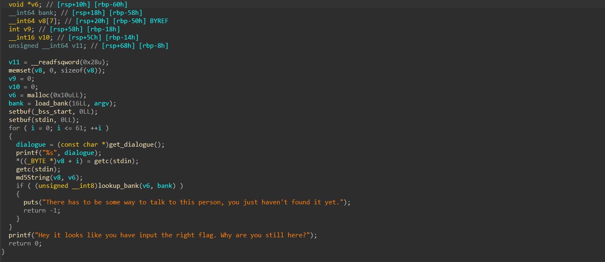

# Anodic Music

## Solution:


After analyzing the binary, we decompiled it to understand its behavior. The program takes a series of inputs and processes them in a loop.

From the decompiled code, we determined the following about the inputs:

First Input: A single character s.
Second Input: A single character r.
Subsequent inputs are appended to this string.

The program computes the MD5 hash of the current input string as follows:

Initially, `cek = md5("s")`.
In the next iteration, `cek = md5("sr")`.
With each loop, it appends the next character to the string and recalculates the MD5 hash.

The computed MD5 hash is checked against a hardcoded list stored in `hardcore.bnk`.

If the hash matches any entry in hardcore.bnk, the input is deemed incorrect, and the program terminates.

The solver builds the flag recursively, starting with `srdnlen{`. It checks each possible character (letters, digits, and {}) by appending it to the current flag and calculating its MD5 hash. If the hash isn’t in the hardcoded hardcore.bnk list, it proceeds recursively. The process continues until a 62-character flag is constructed, using backtracking when no valid character is found.

```py
import string
from hashlib import md5

bank = open("hardcore.bnk", "rb").read()
bank = [bank[i:i+16] for i in range(0, len(bank), 16)]

def solve(flag):
    print(flag)
    global bank
    if len(flag) == 62:
        return flag
    possible = []
    for c in string.ascii_letters + string.digits + "{}_":
        if md5((flag + c).encode()).digest() not in bank:
            possible.append(c)

    if not possible:
        return None
            
    while possible:
        c = possible.pop()
        if md5((flag + c).encode()).digest() not in bank:
            res = solve(flag + c)
            if res:
                return res
            
flag = "srdnlen{"
print(solve(flag))
``` 