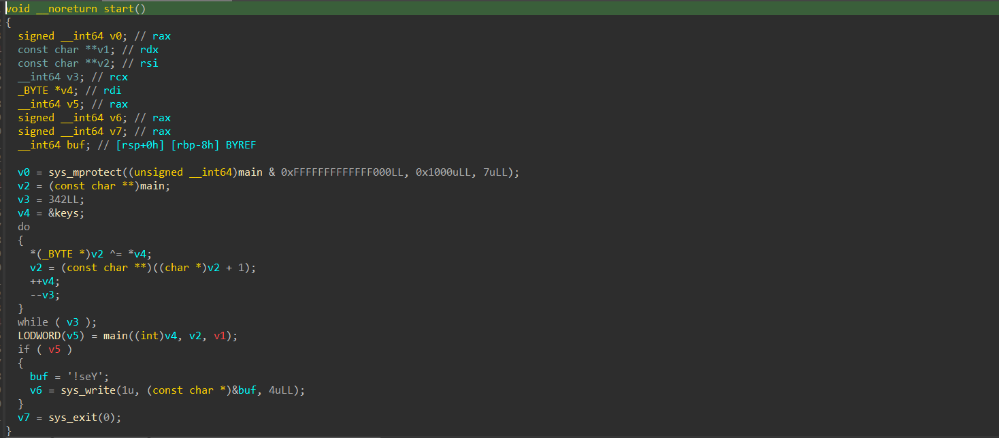
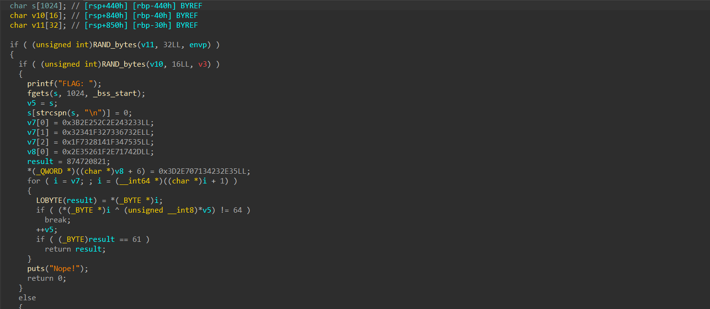

# It's not what it seems

## Solution:



The program modifies the main function before it is called, so the solution involves manually modifying the main function.

```py
from elftools.elf.elffile import ELFFile

f = open("chall", "rb")

data = f.read()
elf = ELFFile(f)
keys = None

for section in elf.iter_sections():
    if section.name == '.data':
        keys = section.data()

addr = 0x10E0
size = len(keys)
mod = open("chall_mod", "wb")
idx = 0

for i in range(len(data)):
    if i >= addr and i < addr + size:
        mod.write(bytes([data[i] ^ keys[idx]]))
        idx += 1
    else:
        mod.write(bytes([data[i]]))
        
mod.close()
```

After that try decompiling the modified binary, and then solving the challenge based on the new decompiled logic.



```py
enc_flag = bytes.fromhex("3332242e2c252e3b2e733673321f34323575341f1428731f2d74712e1f26352e233471702e3d")
flag = ""
for i in range(len(enc_flag)):
    flag += chr(enc_flag[i] ^ 0x40)
print(flag)
```
