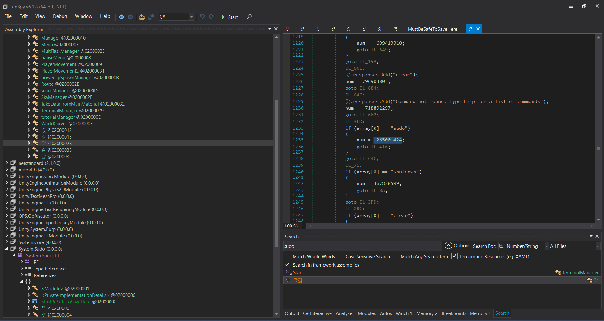
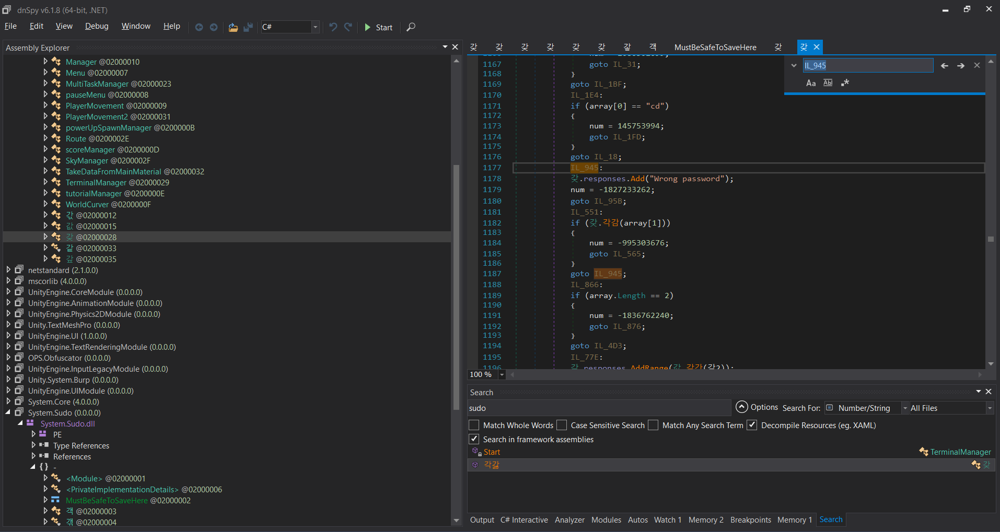
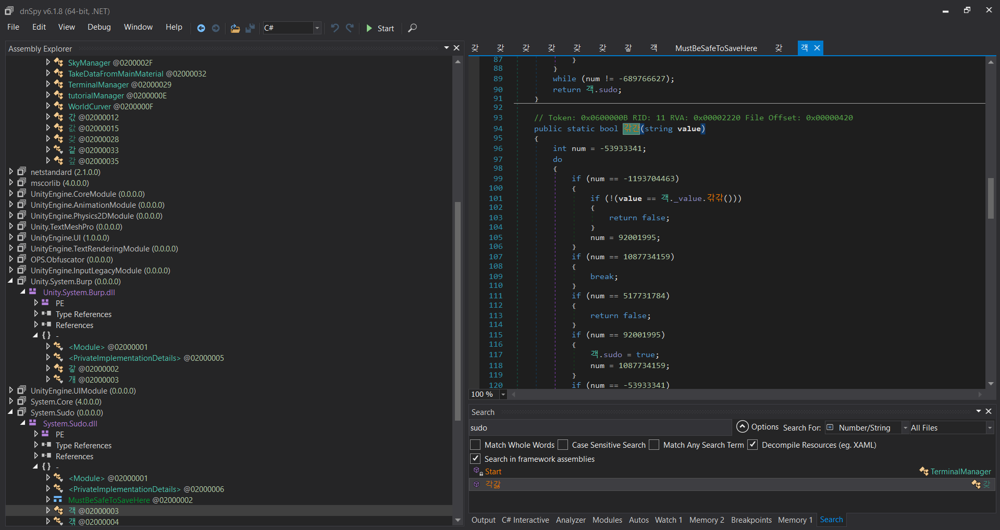
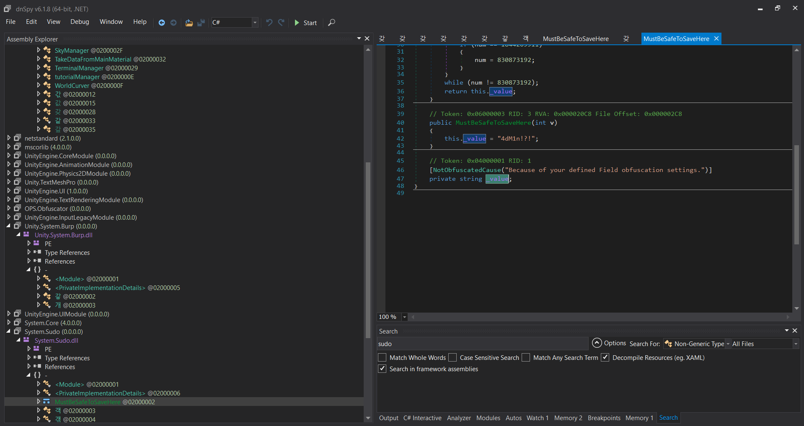
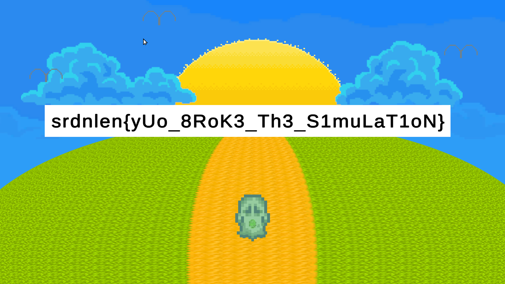

# Unity OS

## Solution:

Unity OS has 3 features: console access, minigames, and sus executables with sudo access. Decompile the `Assembly-CSharp.dll` using dnSpy to analyze how the sudo password check is implemented.

Sadly, it's obfuscated so we need an extra effort to analyze it.

We found that the checker is running on `갖.각감` if the return is false, it will print `Wrong assword` string. After recursively following the class method, we finally found the password checker. Teh program will compare the inputted sudo password with the string `4dM1n!?!`.

Aftering getting the sudo access. we can run the sus executeables and we got the flag.

